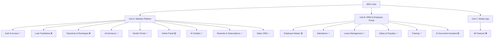

# INTRUST BRD vs. Implementation — Detailed Comparison

**Source BRD:** file:BRD-Intrust.md (March 2026)  
**Codebase:** Next.js 14 App Router, Supabase backend

---

## Legend

| Symbol | Meaning                        |
| ------ | ------------------------------ |
| ✅      | Fully implemented              |
| 🟡     | Partially implemented          |
| ❌      | Not implemented / Missing      |
| 🚀     | Extra — built beyond BRD scope |

---

## 1. Authentication & Access (Unit A)

| BRD Requirement                       | Status | Evidence                                                                                             |
| ------------------------------------- | ------ | ---------------------------------------------------------------------------------------------------- |
| Customer login                        | ✅      | file:app/`(auth)/login/page.jsx`, file:app/api/auth/login/route.js                                   |
| Vendor (Merchant) login               | ✅      | file:app/`(merchant)/merchant/page.jsx`, merchant sidebar                                            |
| Admin login                           | ✅      | file:app/`(admin)/admin/page.jsx`, file:app/api/admin/admins/route.js                                |
| OTP-based authentication              | ✅      | file:app/api/auth/request-otp/route.js, file:app/api/auth/verify-otp/route.js                        |
| Role-based access control (RBAC)      | ✅      | file:lib/auth.js, file:lib/apiAuth.js, file:lib/intentEnforcer.js, Supabase RLS migrations           |
| Forgot password / Reset password      | ✅      | file:app/`(auth)/forgot-password/page.jsx`, file:app/`(auth)/reset-password/page.jsx`                |
| Google OAuth                          | 🚀     | file:app/api/auth/google/route.js — not in BRD                                                       |
| WhatsApp OTP login                    | 🚀     | file:app/api/auth/whatsapp/verify-otp/route.js — not in BRD                                          |
| Account linking (phone + email merge) | 🚀     | file:app/`(auth)/link-complete/page.jsx`, file:app/api/auth/link-complete/route.js — not in BRD      |
| SalesUser (CRM) role                  | ✅      | file:app/`(crm)/crm/page.jsx`, CRM sidebar, file:supabase/migrations/20260425_crm_schema_and_rls.sql |
| Sales Manager role                    | ✅      | CRM reports page, lead assignment                                                                    |
| Employee role                         | ✅      | file:app/`(employee)/employee/page.jsx`                                                              |
| HR Admin / Manager role               | ✅      | file:app/`(hrm)/hrm/page.jsx`, HR manager RLS migrations                                             |

---

## 2. Website Platform — Unit A

### 2.1 Loan Facilitation

| BRD Requirement           | Status | Evidence                                     |
| ------------------------- | ------ | -------------------------------------------- |
| Online loan forms         | ❌      | No dedicated loan form pages found in `app/` |
| Loan progress tracking    | ❌      | Not found                                    |
| Partner disclaimers       | ❌      | Not found                                    |
| Document upload for loans | ❌      | Not found                                    |

> **Note:** Loan facilitation is the most significant gap vs. the BRD. The platform has KYC document upload (file:app/api/kyc/submit/route.js) but no loan-specific workflow.

### 2.2 Payments & Recharges

| BRD Requirement             | Status | Evidence                                                                                                             |
| --------------------------- | ------ | -------------------------------------------------------------------------------------------------------------------- |
| Mobile recharges            | ❌      | No recharge API or page found                                                                                        |
| DTH recharges               | ❌      | Not found                                                                                                            |
| Electricity bill payment    | ❌      | Not found                                                                                                            |
| Gas bill payment            | ❌      | Not found                                                                                                            |
| FASTag payments             | ❌      | Not found                                                                                                            |
| Digital wallet payments     | 🚀     | file:app/api/wallet/balance/route.js, file:app/api/payment/wallet-pay/route.js — full wallet system built beyond BRD |
| SabPaisa payment gateway    | 🚀     | file:app/api/sabpaisa/initiate/route.js, file:app/api/sabpaisa/callback/route.js — not in BRD                        |
| Udhari (credit/debt) system | 🚀     | file:app/api/udhari/request/route.js, file:app/api/udhari/pay/route.js — not in BRD                                  |

### 2.3 eCommerce Marketplace

| BRD Requirement         | Status | Evidence                                                                                          |
| ----------------------- | ------ | ------------------------------------------------------------------------------------------------- |
| Product listing         | ✅      | file:app/`(customer)/shop/page.jsx`, file:app/`(customer)/shop/[merchantSlug]/page.jsx`           |
| Cart                    | ✅      | file:app/`(customer)/shop/cart/page.jsx`, file:app/api/cart/route.js                              |
| Checkout                | ✅      | file:app/`(customer)/shop/checkout/page.jsx`, file:app/api/shopping/wallet-checkout/route.js      |
| Order history           | ✅      | file:app/`(customer)/(protected)/orders/page.jsx`                                                 |
| Product search / browse | ✅      | file:app/`(customer)/shop/StorefrontClient.jsx`, file:app/`(customer)/shop/ShopHubClient.jsx`     |
| Flash sales             | 🚀     | file:app/api/admin/flash-sale/route.js, file:app/`(admin)/admin/flash-sale/page.jsx`              |
| Coupons                 | 🚀     | file:app/api/admin/coupons/route.js, file:app/api/merchant/coupons/route.js                       |
| Gift cards              | 🚀     | file:app/`(customer)/gift-cards/page.jsx`, file:app/api/gift-cards/route.js                       |
| Wishlist                | 🚀     | file:app/`(customer)/(protected)/wishlist/page.jsx`                                               |
| Product ratings         | 🚀     | file:app/`(merchant)/merchant/ratings/page.jsx`                                                   |
| NFC orders              | 🚀     | file:app/api/nfc/order/route.js, file:app/`(customer)/nfc-service/page.jsx`                       |
| Store credits           | 🚀     | file:app/`(customer)/store-credits/page.jsx`, file:app/api/shopping/request-store-credit/route.js |
| Trending products       | 🚀     | file:app/api/shopping/trending-products/route.js                                                  |
| Wholesale purchasing    | 🚀     | file:app/`(merchant)/merchant/shopping/wholesale/page.jsx`                                        |

### 2.4 Vendor (Merchant) Portal

| BRD Requirement                         | Status | Evidence                                                                                                                   |
| --------------------------------------- | ------ | -------------------------------------------------------------------------------------------------------------------------- |
| Product upload & management             | ✅      | file:app/`(merchant)/merchant/shopping/inventory/page.jsx`, file:app/`(merchant)/merchant/shopping/inventory/new/page.jsx` |
| View and process orders                 | ✅      | file:app/`(merchant)/merchant/shopping/orders/page.jsx`                                                                    |
| Download shipping labels                | ✅      | file:app/api/shipping/labels/route.js, file:components/merchant/shopping/ShippingLabelGenerator.jsx                        |
| Manage subscriptions                    | ✅      | file:app/`(merchant)/merchant/subscriptions/page.jsx`, file:components/merchant/SubscriptionContext.jsx                    |
| Merchant application / onboarding       | ✅      | file:app/`(customer)/merchant-apply/page.jsx`, file:app/api/merchant/apply/route.js                                        |
| Merchant wallet & payouts               | 🚀     | file:app/`(merchant)/merchant/wallet/page.jsx`, file:app/api/merchant/payout-request/route.js                              |
| Merchant analytics                      | 🚀     | file:app/`(merchant)/merchant/analytics/page.jsx`                                                                          |
| Merchant referrals                      | 🚀     | file:app/`(merchant)/merchant/referrals/page.jsx`                                                                          |
| Merchant WhatsApp integration           | 🚀     | file:app/`(merchant)/merchant/whatsapp/page.jsx`, file:app/api/merchant/whatsapp/route.js                                  |
| Auto-mode (automated order fulfillment) | 🚀     | file:app/`(merchant)/merchant/shopping/auto-mode/page.jsx`, file:app/api/merchant/auto-mode/route.js                       |
| Merchant investments / lock-in          | 🚀     | file:app/`(merchant)/merchant/investments/page.jsx`, file:app/`(merchant)/merchant/lockin/page.jsx`                        |
| Udhari settings per merchant            | 🚀     | file:app/`(merchant)/merchant/udhari/page.jsx`                                                                             |

### 2.5 Admin Panel

| BRD Requirement                   | Status | Evidence                                                                                                                     |
| --------------------------------- | ------ | ---------------------------------------------------------------------------------------------------------------------------- |
| Vendor approvals                  | ✅      | file:app/api/admin/approve-merchant/route.js, file:app/api/admin/reject-merchant/route.js                                    |
| CMS / Content management          | 🟡     | Banners: file:app/`(admin)/admin/banners/page.jsx`; no full CMS found                                                        |
| Plans & commissions configuration | 🟡     | Subscription guard exists; no dedicated commission config page found                                                         |
| Audit logs                        | ✅      | file:supabase/migrations/20260507_add_hrm_audit_columns_and_policies.sql, HRM audit page file:app/`(hrm)/hrm/audit/page.jsx` |
| Monitor transactions              | ✅      | file:app/`(admin)/admin/transactions/page.js`, file:pages/api/transaction/history.js                                         |
| User management                   | ✅      | file:app/`(admin)/admin/users/page.jsx`, file:app/api/admin/users/route.js                                                   |
| Product approvals                 | ✅      | file:app/`(admin)/admin/shopping/approvals/page.jsx`                                                                         |
| Admin analytics dashboard         | 🚀     | file:app/`(admin)/admin/analytics/page.js`, file:app/api/admin/analytics/route.js                                            |
| Admin revenue tracking            | 🚀     | file:app/api/admin/revenue/route.js                                                                                          |
| Admin wallet adjustments          | 🚀     | file:app/`(admin)/admin/wallet-adjustments/page.jsx`, file:app/api/admin/wallet-adjust/route.js                              |
| Admin reward adjustments          | 🚀     | file:app/api/admin/rewards/adjust/route.js                                                                                   |
| Admin tasks system                | 🚀     | file:app/`(admin)/admin/tasks/page.jsx`, file:components/admin/tasks/TaskCard.jsx                                            |
| Admin payout management           | 🚀     | file:app/`(admin)/admin/payouts/page.jsx`, file:app/api/admin/payout-requests/route.js                                       |
| Admin investments                 | 🚀     | file:app/`(admin)/admin/investments/page.jsx`                                                                                |
| Admin solar module                | 🚀     | file:app/`(admin)/admin/solar/page.jsx`                                                                                      |
| Admin careers management          | 🚀     | file:app/`(admin)/admin/careers/page.jsx`                                                                                    |
| Admin store status control        | 🚀     | file:app/`(admin)/admin/store-status/page.jsx`                                                                               |
| WhatsApp health monitoring        | 🚀     | file:app/api/admin/whatsapp-health/route.js                                                                                  |
| Admin order takeover              | 🚀     | file:app/`(admin)/admin/shopping/orders/takeover/page.jsx`                                                                   |

### 2.6 AI Chatbot (Web)

| BRD Requirement                     | Status | Evidence                                                                                                    |
| ----------------------------------- | ------ | ----------------------------------------------------------------------------------------------------------- |
| Text-based FAQ & service assistance | ✅      | file:app/api/chat/message/route.js, file:app/api/chat/history/route.js, file:app/api/merchant/chat/route.js |

### 2.7 Rewards & Subscriptions

| BRD Requirement       | Status | Evidence                                                                                                   |
| --------------------- | ------ | ---------------------------------------------------------------------------------------------------------- |
| Reward points         | ✅      | file:app/api/rewards/balance/route.js, file:app/`(customer)/(protected)/rewards/page.jsx`                  |
| Reward redemption     | ✅      | file:app/api/rewards/convert/route.js                                                                      |
| Trust badges          | ✅      | file:app/`(customer)/gift-cards/components/TrustBadges.jsx`                                                |
| Subscriptions         | ✅      | file:app/`(merchant)/merchant/subscriptions/page.jsx`, file:components/merchant/SubscriptionGuardModal.jsx |
| Daily login rewards   | 🚀     | file:app/api/rewards/daily-login/route.js                                                                  |
| Rewards leaderboard   | 🚀     | file:app/api/rewards/leaderboard/route.js, file:app/`(customer)/(protected)/rewards/leaderboard/page.jsx`  |
| Rewards referral tree | 🚀     | file:app/api/rewards/tree/route.js, file:app/`(customer)/(protected)/rewards/tree/page.jsx`                |

---

## 3. HRM & Employee Portal — Unit B

### 3.1 Employee Master

| BRD Requirement   | Status | Evidence                                                                                   |
| ----------------- | ------ | ------------------------------------------------------------------------------------------ |
| Employee profiles | ✅      | file:app/`(hrm)/hrm/employees/page.jsx`, file:app/`(employee)/employee/profile/page.jsx`   |
| Departments       | ✅      | Standardized dropdown departments (Engineering, Sales, Operations, HR, Customer Support, Marketing, Finance) are integrated into Core HR employee profiles. |
| KYC documents     | ✅      | file:app/api/kyc/submit/route.js, file:app/`(admin)/admin/users/[id]/KYCReviewSection.jsx` |
| NDA documents     | 🟡     | Document upload exists in HRM; NDA-specific flow not confirmed                             |

### 3.2 Attendance Management

| BRD Requirement                         | Status | Evidence                                                                                                      |
| --------------------------------------- | ------ | ------------------------------------------------------------------------------------------------------------- |
| Clock-in / Clock-out                    | ✅      | file:app/`(hrm)/hrm/attendance/page.jsx`, file:app/`(employee)/employee/attendance/page.jsx`                  |
| Location capture                        | ✅      | file:app/`(employee)/employee/attendance/page.jsx` — Geolocated clock-in/out with onsite detection (within 300m of Mumbai HQ coordinates) and Google Maps links. |
| Late rules                              | 🟡      | Manual late status classification available via HR override; automated late policy logic not implemented.      |
| Attendance overrides with audit logging | ✅      | file:supabase/migrations/20260507_add_hrm_audit_columns_and_policies.sql, file:app/`(hrm)/hrm/audit/page.jsx` |

### 3.3 Leave Management

| BRD Requirement   | Status | Evidence                                                                             |
| ----------------- | ------ | ------------------------------------------------------------------------------------ |
| Leave types       | ✅      | file:app/`(hrm)/hrm/leaves/page.jsx`                                                 |
| Approval workflow | ✅      | file:app/`(hrm)/hrm/leaves/page.jsx`, file:app/`(employee)/employee/leaves/page.jsx` |
| Balance tracking  | ✅      | Leave pages include balance tracking                                                 |

### 3.4 Salary Records

| BRD Requirement           | Status | Evidence                                         |
| ------------------------- | ------ | ------------------------------------------------ |
| Role-based salary setup   | ✅      | file:app/`(hrm)/hrm/salary/page.jsx`             |
| Payslip upload            | ✅      | file:app/`(hrm)/hrm/salary/page.jsx`             |
| Payslip access (employee) | ✅      | file:app/`(employee)/employee/payslips/page.jsx` |

### 3.5 Training Management

| BRD Requirement        | Status | Evidence                                                                                 |
| ---------------------- | ------ | ---------------------------------------------------------------------------------------- |
| Training PDFs & videos | ✅      | file:app/`(hrm)/hrm/training/page.jsx`, file:app/`(employee)/employee/training/page.jsx` |
| Categorized content    | ✅      | Training pages include categorization                                                    |

### 3.6 AI Document Assistant (HRM)

| BRD Requirement        | Status | Evidence                                              |
| ---------------------- | ------ | ----------------------------------------------------- |
| Document-based answers | ✅      | file:app/`(hrm)/hrm/ai-assistant/page.jsx`            |
| Query logging          | 🟡     | AI assistant page exists; query logging not confirmed |

### 3.7 HRM Extras

| Feature                         | Status | Evidence                                                                                        |
| ------------------------------- | ------ | ----------------------------------------------------------------------------------------------- |
| Job postings management         | 🚀     | file:app/`(hrm)/hrm/jobs/page.jsx` — not in BRD                                                 |
| Recruitment pipeline            | 🚀     | file:app/`(hrm)/hrm/recruitment/page.jsx` — not in BRD                                          |
| Career portal (customer-facing) | 🚀     | file:app/`(customer)/career/page.jsx`, file:app/`(customer)/career/apply/page.jsx` — Career KYC gates and resume uploads integrated |
| HRM settings                    | 🚀     | file:app/`(hrm)/hrm/settings/page.jsx` — not in BRD                                             |
| Hire candidate API              | 🚀     | file:app/api/hrm/hire-candidate/route.js — not in BRD                                           |

---

## 4. Sales CRM — Unit A (Internal)

| BRD Requirement                    | Status | Evidence                                                                      |
| ---------------------------------- | ------ | ----------------------------------------------------------------------------- |
| Lead creation & editing            | ✅      | file:app/`(crm)/crm/leads/page.jsx`, file:app/`(crm)/crm/leads/[id]/page.jsx` |
| Lead assignment to sales users     | ✅      | CRM leads page, file:supabase/migrations/20260425_crm_schema_and_rls.sql      |
| Lead status pipeline               | ✅      | file:app/`(crm)/crm/pipeline/page.jsx`                                        |
| Notes & interaction history        | ✅      | Lead detail page                                                              |
| Lead list, filters, keyword search | ✅      | CRM leads page                                                                |
| Sales Manager consolidated view    | ✅      | CRM reports file:app/`(crm)/crm/reports/page.jsx`                             |
| CRM settings                       | 🚀     | file:app/`(crm)/crm/settings/page.jsx` — not in BRD                           |

---

## 5. Mobile Application — Unit C

| BRD Requirement          | Status | Evidence                                     |
| ------------------------ | ------ | -------------------------------------------- |
| OTP login                | ❌      | No React Native / mobile app directory found |
| Biometric authentication | ❌      | Not found                                    |
| Native loan forms        | ❌      | Not found                                    |
| Offline save             | ❌      | Not found                                    |
| Camera upload            | ❌      | Not found                                    |
| UPI intent payments      | ❌      | Not found                                    |
| Contact picker           | ❌      | Not found                                    |
| Mobile eCommerce         | ❌      | Not found                                    |
| AI Voice Assistant       | ❌      | Not found                                    |
| Push notifications       | ❌      | Not found                                    |
| Rewards animations       | ❌      | Not found                                    |

> **Unit C (Mobile App) is entirely not implemented.** The project is a web-only platform at this stage.

---

## 6. Non-Functional Requirements

| Requirement                        | Status | Notes                                                                    |
| ---------------------------------- | ------ | ------------------------------------------------------------------------ |
| Page load under 3 seconds          | 🟡     | Next.js App Router with SSR/SSG — architecture supports it; not measured |
| 99.5% uptime                       | 🟡     | Supabase-hosted; uptime depends on deployment config                     |
| Encryption & RBAC                  | ✅      | Supabase RLS, file:lib/auth.js, file:lib/apiAuth.js                      |
| Audit logs                         | ✅      | HRM audit, admin action logs                                             |
| India-based data residency         | 🟡     | Supabase project `bhgbylyzlwmmabegxlfc` — region not confirmed from code |
| Modular, scalable architecture     | ✅      | Next.js App Router route groups, modular lib/ and components/            |
| RBI-aligned service provider model | ✅      | BRD compliance — no direct financial decisions in code                   |

---

## 7. Deferred Features (BRD Section 8)

All items listed as deferred in the BRD remain unimplemented, as expected:

| Deferred Feature                     | Status                 |
| ------------------------------------ | ---------------------- |
| Loan approval / credit decisioning   | ❌ (correctly deferred) |
| Payroll calculations                 | ❌ (correctly deferred) |
| Tax, PF, ESI processing              | ❌ (correctly deferred) |
| Bank payment file generation         | ❌ (correctly deferred) |
| Advanced analytics & forecasting     | ❌ (correctly deferred) |
| AI decision-making / recommendations | ❌ (correctly deferred) |

---

## 8. Extra Features Built Beyond BRD Scope

These are significant additions not mentioned in the BRD:

| Extra Feature                      | Description                                                      | Key Files                                                                                               |
| ---------------------------------- | ---------------------------------------------------------------- | ------------------------------------------------------------------------------------------------------- |
| **Digital Wallet System**          | Full wallet with top-up, debit, balance, transaction history     | file:app/api/wallet/, file:pages/api/wallet/                                                            |
| **SabPaisa Payment Gateway**       | Full payment gateway integration with callbacks & webhooks       | file:app/api/sabpaisa/                                                                                  |
| **Udhari (Credit/Debt) System**    | Peer-to-peer credit requests, reminders, merchant settings       | file:app/api/udhari/                                                                                    |
| **Gift Cards**                     | Full gift card marketplace with purchase, reveal, and management | file:app/`(customer)/gift-cards/`                                                                       |
| **Flash Sales**                    | Time-limited sale events with admin management                   | file:app/`(admin)/admin/flash-sale/`                                                                    |
| **Coupons System**                 | Merchant and admin coupon creation and redemption                | file:app/api/admin/coupons/, file:app/api/merchant/coupons/                                             |
| **Wishlist**                       | Customer product wishlist                                        | file:app/`(customer)/(protected)/wishlist/`                                                             |
| **Rewards Leaderboard & Tree**     | Gamified rewards with leaderboard and referral tree              | file:app/`(customer)/(protected)/rewards/leaderboard/`, file:app/`(customer)/(protected)/rewards/tree/` |
| **Daily Login Rewards**            | Reward points for daily logins                                   | file:app/api/rewards/daily-login/route.js                                                               |
| **NFC Orders**                     | NFC-based order placement                                        | file:app/`(customer)/nfc-service/`, file:app/api/nfc/                                                   |
| **Store Credits**                  | Store credit request and settlement                              | file:app/`(customer)/store-credits/`, file:app/api/shopping/request-store-credit/                       |
| **Merchant Wallet & Payouts**      | Merchant earnings wallet with withdrawal requests                | file:app/`(merchant)/merchant/wallet/`, file:app/api/merchant/payout-request/                           |
| **Merchant Auto-Mode**             | Automated order fulfillment mode for merchants                   | file:app/`(merchant)/merchant/shopping/auto-mode/`                                                      |
| **Merchant Investments & Lock-in** | Investment and lock-in products for merchants                    | file:app/`(merchant)/merchant/investments/`, file:app/`(merchant)/merchant/lockin/`                     |
| **Merchant Referrals**             | Referral program for merchants                                   | file:app/`(merchant)/merchant/referrals/`                                                               |
| **Merchant WhatsApp Integration**  | WhatsApp notifications and OTP for merchants                     | file:app/`(merchant)/merchant/whatsapp/`                                                                |
| **Merchant Analytics**             | Sales and performance analytics for merchants                    | file:app/`(merchant)/merchant/analytics/`                                                               |
| **Wholesale Purchasing**           | Bulk/wholesale product purchasing for merchants                  | file:app/`(merchant)/merchant/shopping/wholesale/`                                                      |
| **Admin Tasks System**             | Internal task management for admin team                          | file:app/`(admin)/admin/tasks/`                                                                         |
| **Admin Revenue Tracking**         | Revenue analytics and reporting                                  | file:app/api/admin/revenue/route.js                                                                     |
| **Admin Investments**              | Investment product management                                    | file:app/`(admin)/admin/investments/`                                                                   |
| **Admin Solar Module**             | Solar product/service management                                 | file:app/`(admin)/admin/solar/`                                                                         |
| **Admin Careers**                  | Job posting and application management                           | file:app/`(admin)/admin/careers/`                                                                       |
| **Admin Store Status**             | Global store open/close control                                  | file:app/`(admin)/admin/store-status/`                                                                  |
| **Admin Order Takeover**           | Admin ability to take over stuck orders                          | file:app/`(admin)/admin/shopping/orders/takeover/`                                                      |
| **WhatsApp Auth & Notifications**  | WhatsApp-based OTP login and notifications                       | file:app/api/auth/whatsapp/, file:app/api/whatsapp/                                                     |
| **Google OAuth**                   | Google sign-in                                                   | file:app/api/auth/google/route.js                                                                       |
| **Account Linking**                | Merge phone + email accounts                                     | file:app/`(auth)/link-complete/page.jsx`                                                                |
| **KYC Review System**              | Admin KYC document review                                        | file:app/`(admin)/admin/users/[id]/KYCReviewSection.jsx`                                                |
| **HRM Recruitment & Jobs**         | Job postings, recruitment pipeline, career portal                | file:app/`(hrm)/hrm/jobs/`, file:app/`(hrm)/hrm/recruitment/`                                           |
| **Invoice Generation**             | Order invoice generation for customers and admin                 | file:lib/invoiceGenerator.js, file:app/`(admin)/admin/invoice/page.jsx`                                 |
| **Omniflow Webhook**               | External webhook integration                                     | file:app/api/webhooks/omniflow/route.js                                                                 |
| **Cron Jobs**                      | Automated stock checks and order timeouts                        | file:app/api/cron/check-stock/route.js, file:app/api/cron/order-timeout/route.js                        |
| **Referral Network**               | Customer referral network                                        | file:app/api/referral/network/route.js, file:app/`(customer)/(protected)/refer/page.jsx`                |
| **Restock Notifications**          | Notify customers when products are back in stock                 | file:app/api/notify/restock/route.js                                                                    |
| **Lead Task Scheduler**            | Task manager inside CRM Lead details                              | file:app/`(crm)/crm/leads/[id]/page.jsx`, crm_tasks table                                                |
| **Atomic Rate Limiter**            | Database-level atomic rate limiter with retry time & rollbacks   | file:supabase/migrations/20260618000000_otp_rate_limit_improvements.sql, check_rate_limit                |
| **Wholesale Procurement**          | Admin/merchant wholesale procurement from merchants               | file:supabase/migrations/20260531_procurement_schema.sql, procure_from_merchant_rpc                      |
| **Wallet Payout Atomicity**        | Audit-logged secure payout transaction database-level locks      | file:supabase/migrations/20260611_fix_payout_atomicity.sql, payout ledger safety                         |
| **Onboarding Security & Merges**   | Duplicate account merge RPC & bank details verification gates     | file:supabase/migrations/20260620000000_add_merge_duplicate_user_data_rpc.sql, bank verification details |

---

## 9. Summary Dashboard

| Category                | BRD Items | ✅ Done       | 🟡 Partial  | ❌ Missing    |
| ----------------------- | --------- | ------------ | ----------- | ------------ |
| Auth & Access           | 6         | 6            | 0           | 0            |
| Loan Facilitation       | 4         | 0            | 0           | 4            |
| Payments & Recharges    | 5         | 0            | 0           | 5            |
| eCommerce               | 5         | 5            | 0           | 0            |
| Vendor Portal           | 5         | 5            | 0           | 0            |
| Admin Panel             | 6         | 4            | 2           | 0            |
| AI Chatbot              | 1         | 1            | 0           | 0            |
| Rewards & Subscriptions | 3         | 3            | 0           | 0            |
| Sales CRM               | 6         | 6            | 0           | 0            |
| HRM — Employee Master   | 4         | 3            | 1           | 0            |
| HRM — Attendance        | 4         | 3            | 1           | 0            |
| HRM — Leave             | 3         | 3            | 0           | 0            |
| HRM — Salary            | 3         | 3            | 0           | 0            |
| HRM — Training          | 2         | 2            | 0           | 0            |
| HRM — AI Assistant      | 2         | 1            | 1           | 0            |
| Mobile App (Unit C)     | 11        | 0            | 0           | 11           |
| **Total**               | **70**    | **45 (64%)** | **5 (7%)**  | **20 (29%)** |

> **Key Gaps:** Loan facilitation (4 items), utility payments/recharges (5 items), and the entire Mobile App (11 items) account for all 20 missing BRD requirements.

&nbsp;