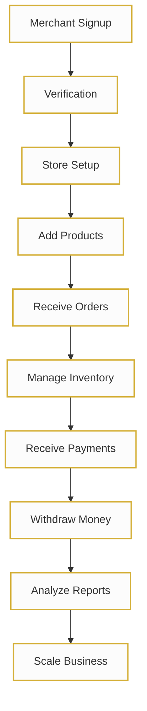

# INTRUST Merchant Portal
## Complete User Guide & Training Manual

**Subtitle:** Everything merchants need to manage products, services, orders, wallet, investments, NFC, lockins, reports and AI automation.  
**Version:** 1.0  
**Prepared for:** INTRUST Merchant Network  

---

# SECTION 1: Welcome

## Introduction
Welcome to the INTRUST Merchant Portal, your all-in-one centralized command center designed to scale your business, manage sales, and automate operations. 

## About INTRUST
INTRUST is an ecosystem built on trust, transparency, and technology. We empower merchants with enterprise-grade tools tailored for fast-paced growth. 

## Platform Overview
The INTRUST Merchant Portal consolidates over 14 distinct business modules—from inventory management and NFC services to AI-driven insights and automated payouts—into a single, secure, and beautiful interface. 

## Mission & Vision
**Mission:** To empower every merchant with the tools necessary to scale their business securely and efficiently.  
**Vision:** A fully connected ecosystem where managing a business is seamless, intelligent, and profitable.

## Platform Benefits
- **Increase Sales:** Reach more customers with streamlined ordering.
- **Fast Settlements:** Quick payouts directly to your bank.
- **Smart Insights:** Make better decisions with our AI Chatbot and automated reports.
- **Trusted Platform:** Secure, reliable, and transparent ecosystem.

## Who should use this portal
Business Owners, Shop Managers, Sales Teams, Customer Support Teams, and Internal Employees.

---

# SECTION 2: Getting Started

[📷 Insert Login/Registration Screenshot]

🎯 **Objective**
To successfully set up your INTRUST merchant account, verify your identity, and access the dashboard.

📖 **Overview**
Getting started is designed to be quick but secure. We require identity verification (KYC) to maintain a trusted ecosystem for all merchants and buyers.

⚙ **How it Works**
You create an account, submit business verification documents, configure your profile, and set up your store details. 

🖱 **Step-by-Step Guide**
1. **Account Creation:** Visit the INTRUST Merchant Portal and click 'Sign Up'. Enter your email and create a password.
2. **Merchant Verification (KYC):** Upload your business registration and identity documents.
3. **Login:** Use your credentials to log in. 
4. **2FA Setup:** Scan the QR code with your authenticator app to enable Two-Factor Authentication.
5. **Profile & Store Setup:** Enter your Business Details, Bank Details, and configure your Storefront appearance.

💡 **Pro Tips**
- Keep your KYC documents handy (PDF or JPEG) before starting the verification process.

⚠ **Common Mistakes**
- Entering incorrect bank details, leading to delayed settlements.

🛠 **Troubleshooting**
- *Forgot Password?* Click 'Password Reset' on the login screen to receive a secure recovery link.

📌 **Best Practices**
- Always enable 2FA to protect your revenue and business data.

---

# SECTION 3: Dashboard Training

[📷 Insert Dashboard Screenshot]

🎯 **Objective**
To understand the central hub of your business and track daily performance at a glance.

📖 **Overview**
Your Dashboard is the nerve center. It provides real-time snapshots of your wallet, revenue, orders, and products.

⚙ **How it Works**
The dashboard aggregates data from all modules and displays it in easy-to-read charts and quick-action cards.

🖱 **Dashboard Elements Explained**
- **Wallet Balance:** Real-time view of your available funds with a quick 'Add Money' button.
- **Today's Overview:** Instant metrics for Orders, Revenue, Products, and Payouts.
- **Business Summary Chart:** A dynamic line graph showing monthly growth and revenue trends.
- **Quick Actions:** Shortcuts to Add Product, NFC Order, Orders, Reports, Investment, and Auto Mode.
- **Recent Notifications:** Real-time alerts for payments, order statuses, and low stock.
- **Recent Orders:** A quick list of your latest orders and their processing status.

💡 **Pro Tips**
- Check your 'Recent Notifications' daily to stay ahead of low stock alerts and payout confirmations.

⚠ **Common Mistakes**
- Ignoring the Business Summary chart, missing out on identifying sales trends.

🛠 **Troubleshooting**
- *Data not updating?* Refresh the page or check your internet connection; the dashboard syncs in real-time.

📌 **Best Practices**
- Use 'Quick Actions' to drastically reduce the time spent navigating the portal.

---

# SECTION 4: Products & Inventory

[📷 Insert Products Screenshot]

🎯 **Objective**
To build your digital catalog, manage stock levels, and optimize product listings.

📖 **Overview**
The Products & Inventory module is where you define what you sell. It handles categories, pricing, variants, and stock control.

⚙ **How it Works**
Add products manually or via bulk upload. Set pricing, GST, and track inventory automatically as orders are placed.

🖱 **Step-by-Step Guide: Adding a Product**
1. Navigate to **Products & Inventory**.
2. Click **+ Add Product**.
3. Fill in the **Product Name**, **Categories**, and **Sub Categories**.
4. Upload high-quality **Images**.
5. Set the **Pricing**, **Discount**, and **GST**.
6. Input initial **Stock** for Inventory tracking.
7. Add **Variants** (e.g., Size, Color) if needed.
8. Save and set **Product Status** to Active.

💡 **Pro Tips**
- Optimize your product descriptions for SEO to rank higher in customer searches.

⚠ **Common Mistakes**
- Forgetting to activate the product status after creating it.

🛠 **Troubleshooting**
- *Stock not updating?* Ensure 'Manage Inventory' is toggled ON for that specific product.

📌 **Best Practices**
- Configure **Low Stock Alerts** so you have time to replenish before items sell out.

### 🏋️ Training Exercise
**Exercise 1:** Create a test product, add two variants (e.g., Red, Blue), set a 10% discount, and save it.

### 🧠 Knowledge Check
**Q1: What must be toggled on to automatically reduce stock when an order is placed?**
A) SEO  B) Manage Inventory  C) GST  D) Variants
*Answer: B*

---

# SECTION 5: Order Management

[📷 Insert Orders Screenshot]

🎯 **Objective**
To seamlessly process customer orders from placement to delivery.

📖 **Overview**
Order Management gives you full control over the order lifecycle, ensuring customers receive their purchases promptly.

⚙ **How it Works**
Orders flow through specific statuses: New ➔ Accepted ➔ Packed ➔ Shipped ➔ Delivered. 

🖱 **Step-by-Step Guide: Processing an Order**
1. Go to **Orders Management**.
2. View a **New Order** and review the details.
3. Click **Accept** to notify the customer.
4. Prepare the item and click **Packed**.
5. Generate **Invoices** and **Shipping Labels**.
6. Once dispatched, update the status to **Shipped** and add **Tracking** details.
7. Mark as **Delivered** once confirmed.

💡 **Pro Tips**
- Use **Order Notes** to leave internal messages for your team regarding specific customer requests.

⚠ **Common Mistakes**
- Forgetting to input tracking numbers, leading to customer support inquiries.

🛠 **Troubleshooting**
- *Need to process a refund?* Use the Return / Refund workflow directly from the specific Order Timeline.

📌 **Best Practices**
- Always maintain clear **Customer Communication** at every status change to build trust.

---

# SECTION 6: NFC Services

[📷 Insert NFC Screenshot]

🎯 **Objective**
To leverage contactless technology to enhance customer experience and streamline operations.

📖 **Overview**
NFC (Near Field Communication) Services allow you to order, customize, and manage smart cards for your business.

⚙ **How it Works**
Order custom NFC cards linked to your business. Track card usage, manage bulk orders, and view interaction analytics.

🖱 **Step-by-Step Guide**
1. Navigate to **NFC Services**.
2. Select **NFC Card Orders** to view existing orders or **Custom NFC Cards** to design a new one.
3. Place an order (single or Bulk).
4. Use **Order Tracking** to monitor delivery.
5. Once received, complete the **Activation Process** via the portal.

💡 **Pro Tips**
- Use custom NFC cards as loyalty cards or instant-review taps for your physical storefront.

⚠ **Common Mistakes**
- Distributing NFC cards before completing the Activation Process in the portal.

🛠 **Troubleshooting**
- *Card not scanning?* Ensure the card is active in the NFC Analytics dashboard.

📌 **Best Practices**
- Review **NFC Analytics** weekly to measure how often customers are interacting with your cards.

---

# SECTION 7: Investment (AI Grow)

[📷 Insert Investment Screenshot]

🎯 **Objective**
To grow your surplus business capital through smart, managed investment plans.

📖 **Overview**
Investment (AI Grow) offers merchants a way to earn passive income by investing wallet balances into secure growth plans.

⚙ **How it Works**
Select an investment plan, allocate funds from your wallet, and track expected returns and portfolio growth over time.

🖱 **Step-by-Step Guide**
1. Open the **Investment (AI Grow)** module.
2. Review the **Investment Dashboard** and available **Plans**.
3. Select a plan and review the **Expected Returns** and **Risk Notice**.
4. Confirm the investment amount.
5. Monitor your **Portfolio** and **Growth Tracking** charts.

💡 **Pro Tips**
- Reinvest your **Referral Earnings** directly into AI Grow for compounded growth.

⚠ **Common Mistakes**
- Withdrawing funds before the maturity date, which may result in lower returns.

🛠 **Troubleshooting**
- *Earnings not reflecting?* Returns are typically updated on a 24-hour cycle. Check your History tab.

📌 **Best Practices**
- Read all Performance Reports and Risk Notices before committing large sums of capital.

---

# SECTION 8: Lockin Management

[📷 Insert Lockin Screenshot]

🎯 **Objective**
To understand and manage funds that are temporarily held for security or compliance.

📖 **Overview**
Lockin Management provides transparency on funds that are locked, the rules governing them, and release schedules.

⚙ **How it Works**
Certain transactions or platform guarantees require a temporary lockin. You can view the status and request releases when eligible.

🖱 **Step-by-Step Guide**
1. Go to **Lockin Management**.
2. View your **Lockin Summary** to see total locked funds.
3. Check the **Lockin Rules** to understand why specific funds are held.
4. When eligible, submit **Release Requests**.
5. Monitor the **Lockin Status** until the funds move to Settlement.

💡 **Pro Tips**
- Maintain high ratings and low dispute rates to minimize mandatory lockin periods.

⚠ **Common Mistakes**
- Submitting a release request before the mandatory lockin period has expired.

🛠 **Troubleshooting**
- *Request denied?* Review the Frequently Asked Questions to ensure all compliance rules are met.

📌 **Best Practices**
- Treat lockin funds as a reserve and do not account for them in immediate daily cash flow.

---

# SECTION 9: Wallet & Payouts

[📷 Insert Wallet Screenshot]

🎯 **Objective**
To seamlessly manage your cash flow, add funds, and withdraw earnings to your bank.

📖 **Overview**
The Wallet is your financial hub. It tracks every penny entering and leaving your merchant account.

⚙ **How it Works**
Revenue from orders flows into your wallet. From here, you can Add Money, view Transactions, or initiate Payouts to Bank.

🖱 **Step-by-Step Guide: Withdrawing Money**
1. Navigate to **Wallet & Payouts**.
2. Check your available **Wallet Balance**.
3. Click **Withdrawal** (or Payouts to Bank).
4. Enter the amount and select your saved bank account.
5. Review the **Payout Timeline** and confirm.
6. Check **Payout Reports** to track settlement status.

💡 **Pro Tips**
- Schedule withdrawals on specific days (e.g., every Friday) to simplify your business accounting.

⚠ **Common Mistakes**
- Attempting to withdraw uncleared funds that are still pending settlement.

🛠 **Troubleshooting**
- *Failed Transaction?* Verify that your Bank Details in Profile & Settings are accurate and active.

📌 **Best Practices**
- Regularly download your **Reports** for tax and reconciliation purposes.

### 🏋️ Training Exercise
**Exercise 4:** Initiate a test withdrawal of a small amount to verify your bank connection.

---

# SECTION 10: Gift Card Marketplace

[📷 Insert Gift Card Screenshot]

🎯 **Objective**
To generate additional revenue by buying and selling digital gift cards.

📖 **Overview**
The Gift Card Marketplace allows you to create custom gift cards for your store or participate in buying/selling platform cards.

⚙ **How it Works**
List your cards, set custom pricing, and track orders. The system handles the delivery and commission calculations.

🖱 **Step-by-Step Guide**
1. Open **Gift Card Buy / Sell**.
2. Navigate to **Gift Card Listings**.
3. Click **Sell Gift Cards** to create a new offering.
4. Set the **Pricing** and value.
5. Track sales in **Transaction History**.

💡 **Pro Tips**
- Offer promotional discounts on high-value gift cards during holiday seasons to boost immediate cash flow.

⚠ **Common Mistakes**
- Setting the sale price lower than the face value without accounting for your profit margins.

🛠 **Troubleshooting**
- *Customer didn't receive the card?* You can easily resend the digital code from the Order Tracking tab.

📌 **Best Practices**
- Monitor your **History** and **Commission** reports to optimize your pricing strategy.

---

# SECTION 11: Reports & Analytics

[📷 Insert Reports Screenshot]

🎯 **Objective**
To leverage data for informed, strategic business decisions.

📖 **Overview**
Reports & Analytics provide deep insights into your sales, customer behavior, and financial health.

⚙ **How it Works**
The portal automatically aggregates your data into visual charts and detailed tables that can be exported.

🖱 **Step-by-Step Guide**
1. Go to **Reports & Analytics**.
2. Select the report type: **Sales Reports**, **Revenue Reports**, or **Product Reports**.
3. Adjust the date range on the **Charts**.
4. Review your **Merchant Growth** and **Performance** metrics.
5. Click **Export Reports** to download as CSV or PDF.

💡 **Pro Tips**
- Focus on the 'Product Reports' to identify your top-performing and lowest-performing items.

⚠ **Common Mistakes**
- Making inventory decisions based on a single week's data rather than monthly trends.

🛠 **Troubleshooting**
- *Export failing?* Ensure you haven't selected a date range that is too large (try exporting month-by-month).

📌 **Best Practices**
- Schedule a weekly block of time dedicated to **Understanding Metrics** and **Decision Making**.

---

# SECTION 12: AI Assistant

[📷 Insert AI Assistant Screenshot]

🎯 **Objective**
To utilize artificial intelligence for business support, automation, and strategy.

📖 **Overview**
The AI Chatbot is your 24/7 digital co-pilot. It answers questions, provides business suggestions, and helps with customer service.

⚙ **How it Works**
Type your query into the chat interface. The AI analyzes your store data and the INTRUST knowledge base to provide instant, actionable answers.

🖱 **Step-by-Step Guide**
1. Click the **AI Chatbot** icon on the dashboard or sidebar.
2. Ask a question or use the suggested **Prompt Examples** (e.g., "Analyze my sales this week").
3. Review the **Business Suggestions** and **Sales Tips** provided.
4. Use the AI to help draft customer responses or optimize product descriptions.

💡 **Pro Tips**
- Treat the AI as a **Business Coach**—ask it for marketing ideas tailored to your specific inventory.

⚠ **Common Mistakes**
- Asking overly vague questions. Be specific for better results.

🛠 **Troubleshooting**
- *AI not understanding?* Rephrase your question or select from the Frequently Asked Questions list.

📌 **Best Practices**
- Use the AI to quickly locate specific settings or reports without clicking through multiple menus.

---

# SECTION 13: Automation (Auto Mode)

[📷 Insert Auto Mode Screenshot]

🎯 **Objective**
To save time and reduce manual errors by automating repetitive business tasks.

📖 **Overview**
Auto Mode puts your eCommerce operations on autopilot, handling syncing, pricing, and notifications while you sleep.

⚙ **How it Works**
You define rules and schedules. The system automatically executes tasks based on those triggers.

🖱 **Step-by-Step Guide**
1. Navigate to **Auto Mode**.
2. Toggle on **Auto Product Sync** if you are integrating external catalogs.
3. Set up **Pricing Rules** (e.g., automatically apply a 5% discount on weekends).
4. Configure **Auto Order Processing** for digital goods or trusted buyers.
5. Schedule **Auto Report Generation** to receive weekly analytics in your email.

💡 **Pro Tips**
- Use **Smart Notifications** to alert you only when an anomaly occurs (like a sudden drop in sales).

⚠ **Common Mistakes**
- Turning on Auto Order Processing for high-risk physical goods without proper fraud checks.

🛠 **Troubleshooting**
- *Automation didn't trigger?* Check the Scheduling settings to ensure the time zone is correct.

📌 **Best Practices**
- Start small. Automate reports first, then gradually introduce pricing and inventory automations.

---

# SECTION 14: Ratings

[📷 Insert Ratings Screenshot]

🎯 **Objective**
To monitor and improve customer satisfaction and your merchant reputation.

📖 **Overview**
The Ratings module tracks both Product Ratings and overall Seller Ratings left by verified buyers.

⚙ **How it Works**
Customers leave feedback post-purchase. This data is aggregated into an Analytics dashboard for your review.

🖱 **Step-by-Step Guide**
1. Go to the **Ratings** module.
2. Review your overall **Merchant Ratings**.
3. Drill down into specific **Product Ratings**.
4. Analyze the **Customer Feedback** to identify trends.
5. Use insights to implement **Improving Ratings** strategies.

💡 **Pro Tips**
- Always reply politely to negative reviews. Future customers read responses to see how you handle issues.

⚠ **Common Mistakes**
- Ignoring poor product ratings instead of improving the product or updating the description.

🛠 **Troubleshooting**
- *Unfair review?* You can flag reviews that violate INTRUST's community guidelines for moderation.

📌 **Best Practices**
- Maintain a high seller rating to benefit from priority placement in platform searches and lower lockin periods.

---

# SECTION 15: Referral System

[📷 Insert Referral Screenshot]

🎯 **Objective**
To earn additional income by expanding the INTRUST network.

📖 **Overview**
The Referral & Earn module rewards you for inviting other business owners to the platform.

⚙ **How it Works**
Share your unique invite link. When a new merchant signs up and transacts, you earn a percentage of commission.

🖱 **Step-by-Step Guide**
1. Navigate to **Referrals & Earn**.
2. Copy your unique link to **Invite Merchants**.
3. Track clicks and signups on the **Referral Tracking** dashboard.
4. View your **Payout History** and **Commission** earned.
5. Check the **Leaderboard** to see top referrers.

💡 **Pro Tips**
- Share your referral link in merchant Facebook groups or local business networks.

⚠ **Common Mistakes**
- Spamming the link without providing context on why INTRUST is beneficial.

🛠 **Troubleshooting**
- *Commission not showing?* Commissions are credited only after the referred merchant completes their first verified transaction.

📌 **Best Practices**
- Follow the **Referral Tips** provided in the dashboard for high-conversion outreach templates.

---

# SECTION 16: Support Center

[📷 Insert Support Screenshot]

🎯 **Objective**
To quickly resolve any technical or account-related issues.

📖 **Overview**
The Support Center is your direct line to the INTRUST operations team, featuring ticket management and a robust Help Center.

⚙ **How it Works**
Search the FAQs for instant answers, or submit a support ticket for personalized assistance.

🖱 **Step-by-Step Guide**
1. Open the **Support** module.
2. Browse the **Help Center** and **FAQs**.
3. If unresolved, click **Contact Us** to open a new Ticket.
4. Provide detailed information and screenshots.
5. **Track Tickets** to monitor the **Response Time** and resolution.

💡 **Pro Tips**
- Include order numbers or transaction IDs in your initial ticket to speed up the **Support Workflow**.

⚠ **Common Mistakes**
- Opening multiple tickets for the same issue, which slows down the response time.

🛠 **Troubleshooting**
- *Critical issue?* Use the **Issue Escalation** option for urgent matters like account lockouts.

📌 **Best Practices**
- Always consult the AI Chatbot first; it can resolve 80% of common queries instantly.

---

# SECTION 17: Profile & Settings

[📷 Insert Settings Screenshot]

🎯 **Objective**
To configure your business identity, team access, and platform preferences.

📖 **Overview**
Profile & Settings is where you manage the foundational data of your account, including security and team permissions.

⚙ **How it Works**
Update your information, add staff accounts with restricted access, and customize your portal experience.

🖱 **Step-by-Step Guide**
1. Go to **Profile & Settings**.
2. Update your **Business Information** and **Bank Details** as needed.
3. Navigate to **Team Members** to invite staff and set specific **Permissions**.
4. Go to **Security** to update your **Password** or manage **2FA**.
5. Adjust **Notification Settings**, **Language**, and **Theme** (Light/Dark mode).

💡 **Pro Tips**
- Give your staff only the permissions they need (e.g., allow fulfillment staff access to Orders, but restrict Wallet & Payouts).

⚠ **Common Mistakes**
- Changing Bank Details without verifying with 2FA, causing payout delays.

🛠 **Troubleshooting**
- *Staff can't log in?* Ensure you've sent them the activation link and their status is marked as 'Active'.

📌 **Best Practices**
- Audit your Team Members list quarterly to remove access for former employees.

---

# SECTION 18: Security & Trust

[📷 Insert Security Screenshot]

🎯 **Objective**
To maintain a safe, fraud-free environment for your business and your customers.

📖 **Overview**
INTRUST employs bank-grade security protocols. This section explains how to utilize them to protect your business.

⚙ **How it Works**
The platform runs background Fraud Monitoring, requires Merchant Verification, and uses Data Encryption for all transactions.

🖱 **Security Features Checklist**
- [x] **Merchant Verification:** Completed during onboarding.
- [x] **Data Encryption:** End-to-end encryption is automatically applied.
- [x] **Safe Payments:** All transactions run through secure gateways.
- [x] **2FA:** Two-factor authentication for logins and withdrawals.
- [x] **Regular Security Audits:** Conducted automatically by INTRUST.

💡 **Pro Tips**
- Follow strict **Password Guidelines** (use a mix of symbols, numbers, and cases, and never reuse passwords).

⚠ **Common Mistakes**
- Logging into your merchant portal on public, unsecured Wi-Fi networks.

🛠 **Troubleshooting**
- *Account locked out?* This happens after multiple failed login attempts. Contact Support for Identity Verification.

📌 **Best Practices**
- Ensure good **Device Security**—keep your computer and smartphone OS up to date.

---

# SECTION 19: Business Growth Guide

[📷 Insert Growth Screenshot]

🎯 **Objective**
To leverage the portal's tools to actively scale and expand your business.

📖 **Overview**
This section is a strategic playbook on using INTRUST features (like AI, Reports, and NFC) to maximize revenue.

💡 **Merchant Success Tips**
- **How to Increase Sales:** Utilize Auto Mode for dynamic pricing and use the Gift Card marketplace to capture advance revenue.
- **Product Optimization:** Use high-quality images and AI-generated SEO descriptions.
- **Customer Engagement:** Distribute Custom NFC Cards to encourage repeat visits and quick reorders.
- **Cross-selling & Upselling:** Bundle related products using the variant and category tools.
- **Using Reports:** Identify your highest margin products and focus your marketing efforts there.
- **Business Expansion:** Reinvest your earnings through the AI Grow Investment module to build a safety net for expansion.

📌 **Best Practices**
- Review this guide monthly. Scaling is a continuous process of analyzing data and adjusting strategy.

---

# SECTION 20: Complete Merchant Workflow

This flowchart visualizes the end-to-end journey of a successful merchant on the INTRUST platform.

---

# APPENDIX

## Keyboard Shortcuts
- `Ctrl/Cmd + S`: Save changes (Products/Settings)
- `Ctrl/Cmd + P`: Print Invoice/Shipping Label
- `Ctrl/Cmd + F`: Quick Search within Dashboard

## Glossary
- **KYC:** Know Your Customer (Verification process).
- **2FA:** Two-Factor Authentication.
- **NFC:** Near Field Communication.
- **Lockin:** Funds temporarily held for compliance or security.
- **Auto Mode:** The automation suite of the portal.

## Frequently Asked Questions
- **Q: How long do payouts take?**
  *A: Standard payouts process within 24 hours to verified bank accounts.*
- **Q: Can I access the portal on mobile?**
  *A: Yes, the INTRUST Merchant Portal is fully responsive and optimized for mobile browsers.*

## Support Contacts
- **Help Center:** In-app Support Module
- **Email:** merchantsupport@intrustindia.com
- **Emergency Escalation:** Available via the AI Chatbot for Priority Merchants.

---
*End of Document. Designed for the modern merchant. Empowering People. Building Trust.*
