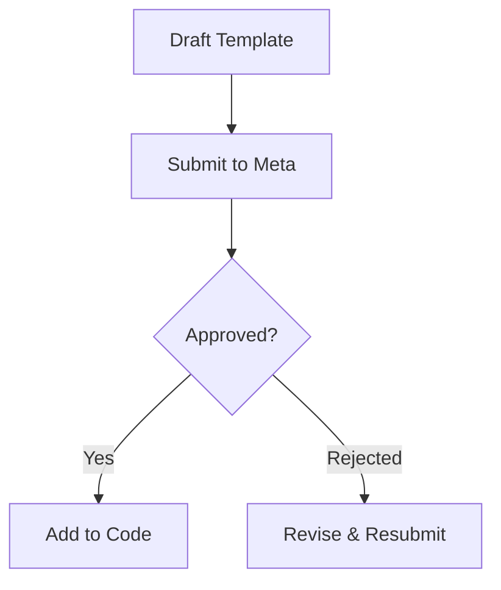

# WhatsApp Template Catalogue

> [!WARNING]
> This file is the master reference for all WhatsApp templates. Keep this document strictly in sync with `lib/omniflow.js`.

**Meta Category Note:** All templates here belong to the **Utility** category. The Authentication (OTP) template has been decommissioned and removed.

**Variable Rule:** Variables must exactly match the `{{1}}` format.

**References:** Use `/api/admin/whatsapp-health` for health checks and `/api/admin/whatsapp-test-merchant` for test sends.

## §1 — Master catalogue table

> [!NOTE]
> Templates 9 & 17 are NEW. Templates 3–5 are health-tracked.

| # | Template Name | Category | Lang | Vars | Code Symbol | Fired By |
|---|---|---|---|---|---|---|
| 1 | `intrust_welcome_linked` | Utility | en_US | 0 | `WELCOME_TEMPLATE` | Customer Linking |
| 2 | `intrust_kyc_update` | Utility | en_US | 2 | `KYC_UPDATE_TEMPLATE` | KYC Webhook |
| 3 | `intrust_transaction_alert` | Utility | en_US | 3 | `TRANSACTION_ALERT_TEMPLATE` | Ledger |
| 4 | `intrust_login_alert` | Utility | en_US | 2 | `LOGIN_ALERT_TEMPLATE` | Auth |
| 5 | `intrust_merchant_welcome_linked` | Utility | en_US | 0 | `MERCHANT_WELCOME_LINKED_TEMPLATE` | Merchant Linking |
| 6 | `intrust_merchant_new_order` | Utility | en_US | 3 | `MERCHANT_NEW_ORDER_TEMPLATE` | Order Complete |
| 7 | `intrust_merchant_order_cancelled` | Utility | en_US | 2 | `MERCHANT_ORDER_CANCELLED_TEMPLATE` | Order Cancelled |
| 8 | `intrust_merchant_payout_status` | Utility | en_US | 3 | `MERCHANT_PAYOUT_STATUS_TEMPLATE` | Settlement Job |
| 9 | `intrust_merchant_payout_requested` | Utility | en_US | 2 | `MERCHANT_PAYOUT_REQUESTED_TEMPLATE` | Payout Request |
| 10 | `intrust_merchant_store_credit_request` | Utility | en_US | 3 | `MERCHANT_STORE_CREDIT_REQUEST_TEMPLATE` | Store Credit |
| 11 | `intrust_merchant_store_credit_paid` | Utility | en_US | 2 | `MERCHANT_STORE_CREDIT_PAID_TEMPLATE` | Settlement Job |
| 12 | `intrust_merchant_gift_card_sold` | Utility | en_US | 2 | `MERCHANT_GIFT_CARD_SOLD_TEMPLATE` | Gift Card Sales |
| 13 | `intrust_merchant_bank_verified` | Utility | en_US | 0 | `MERCHANT_BANK_VERIFIED_TEMPLATE` | KYC Webhook |
| 14 | `intrust_merchant_approved` | Utility | en_US | 2 | `MERCHANT_APPROVED_TEMPLATE` | Onboarding |
| 15 | `intrust_merchant_subscription_status` | Utility | en_US | 2 | `MERCHANT_SUBSCRIPTION_STATUS_TEMPLATE` | Billing |
| 16 | `intrust_merchant_product_approved` | Utility | en_US | 3 | `MERCHANT_PRODUCT_APPROVED_TEMPLATE` | Catalogue Audit |
| 17 | `intrust_merchant_procurement_sale` | Utility | en_US | 3 | `MERCHANT_PROCUREMENT_SALE_TEMPLATE` | Procurement |

## §2 — Customer utility templates

### 1. `intrust_welcome_linked`
- **Body**:
  ```text
  ✅ Your WhatsApp has been successfully linked to your InTrust India account.

  You can now use this chat to:
  • Check your wallet balance
  • View your KYC verification status
  • Review recent transactions

  Simply send us a message and our assistant will respond instantly.
  For detailed account management, visit: intrustindia.com
  ```
- **Footer**: InTrust India | Your Trusted Financial Partner
- **Buttons**:
  - [Quick Reply] `Check Balance`
  - [Quick Reply] `My KYC Status`

### 2. `intrust_kyc_update`
- **Body**:
  ```text
  📋 *KYC Verification Update — InTrust India*

  Your KYC status has been updated to: *{{1}}*

  {{2}}

  If you have questions about your KYC status, please visit your profile
  at intrustindia.com or reply to this message for assistance.
  ```
- **Variables**: {{1}} = KYC status, {{2}} = Action note
- **Footer**: InTrust India | Regulated & Secure
- **Buttons**: (none)

### 3. `intrust_transaction_alert`
- **Body**:
  ```text
  💸 *Transaction Alert — InTrust India*

  ₹{{1}} has been {{2}} your InTrust wallet.

  Updated Balance: *₹{{3}}*

  If you did not authorise this transaction, please contact our support
  team immediately at intrustindia.com or reply HELP.
  ```
- **Variables**: {{1}} = Transaction amount, {{2}} = Direction, {{3}} = Wallet balance
- **Footer**: InTrust India | Secure Wallet
- **Buttons**:
  - [Quick Reply] `Not Me`
  - [Quick Reply] `View Details`
  - [URL] `View Wallet`

### 4. `intrust_login_alert`
- **Body**:
  ```text
  🔐 *Security Alert — InTrust India*

  A new login was detected on your InTrust account.

  📍 Location / Device: {{1}}
  🕐 Time: {{2}}

  If this was you, no action is needed.
  If you do *not* recognise this activity, please secure your account
  immediately by visiting intrustindia.com or replying HELP.
  ```
- **Variables**: {{1}} = Location or device info, {{2}} = Timestamp
- **Footer**: InTrust India | Account Security
- **Buttons**:
  - [Quick Reply] `This Was Me`
  - [Quick Reply] `Secure My Account`
  - [URL] `Secure Account`

## §3 — Merchant utility templates

### 5. `intrust_merchant_welcome_linked`
- **Body**:
  ```text
  🤝 *Welcome to InTrust India Merchant Services*

  Your WhatsApp has been successfully linked. You will now receive real-time business alerts and transaction notifications directly here.

  *You'll stay updated on:*
  • New Order Alerts 🛍️
  • Payout & Settlement Status 💸
  • Store Credit Requests 📝
  • Security & Account Updates 🔐

  We're excited to have you onboard!
  ```
- **Footer**: InTrust India | Merchant Partner
- **Buttons**:
  - [Quick Reply] `View Dashboard`
  - [Quick Reply] `My Balance`

### 6. `intrust_merchant_new_order`
- **Body**:
  ```text
  🛍️ *New Order Received!*

  A new order has been placed at your store.

  *Order ID*: {{1}}
  *Total Amount*: ₹{{2}}
  *Items Count*: {{3}}

  Please review the order details and begin processing to ensure timely delivery.
  ```
- **Variables**: {{1}} = Order ID, {{2}} = Amount, {{3}} = Total Items
- **Footer**: InTrust India | Order Management
- **Buttons**:
  - [Quick Reply] `View Order Details`
  - [Quick Reply] `Manage Orders`

### 7. `intrust_merchant_order_cancelled`
- **Body**:
  ```text
  ❌ *Order Cancellation Alert*

  The following order has been cancelled:

  *Order ID*: {{1}}
  *Reason*: {{2}}

  No further action is required for this order. If items were already packed, please return them to inventory.
  ```
- **Variables**: {{1}} = Order ID, {{2}} = Cancellation Reason
- **Footer**: InTrust India | Inventory Update
- **Buttons**:
  - [Quick Reply] `View Order`
  - [Quick Reply] `Contact Support`

### 8. `intrust_merchant_payout_status`
- **Body**:
  ```text
  💸 *Payout Processed Successfully*

  Your settlement has been initiated.

  *Amount*: ₹{{1}}
  *Status*: *{{2}}*
  *Reference*: {{3}}

  Funds usually reflect in your registered bank account within 24-48 hours.
  ```
- **Variables**: {{1}} = Amount, {{2}} = Payout Status, {{3}} = Ref/Note
- **Footer**: InTrust India | Secure Settlements
- **Buttons**:
  - [Quick Reply] `Settlement History`
  - [Quick Reply] `My Bank Details`

### 9. `intrust_merchant_payout_requested` **(NEW — proposed copy)**
- **Body**:
  ```text
  💸 *Payout Requested*

  A new payout request has been received.
  
  *Amount*: ₹{{1}}
  *Source*: {{2}}

  We are processing your request and will notify you upon settlement.
  ```
- **Variables**: {{1}} = Amount, {{2}} = Source
- **Footer**: InTrust India | Secure Settlements
- **Buttons**:
  - [Quick Reply] `View Payouts`

### 10. `intrust_merchant_store_credit_request`
- **Body**:
  ```text
  📝 *New Store Credit Request*

  A customer has requested to use store credit for a purchase.

  *Customer*: {{1}}
  *Amount*: ₹{{2}}
  *Item/Order*: {{3}}

  Please approve or decline this request from your merchant panel.
  ```
- **Variables**: {{1}} = Customer Name, {{2}} = Credit Amount, {{3}} = Item Description
- **Footer**: InTrust India | Credit Management
- **Buttons**:
  - [Quick Reply] `Review Request`
  - [Quick Reply] `View All Requests`

### 11. `intrust_merchant_store_credit_paid`
- **Body**:
  ```text
  ✅ *Store Credit Settlement Confirmed*

  The credit for the following item has been successfully settled to your balance.

  *Amount*: ₹{{1}}
  *Item*: {{2}}

  Thank you for supporting our store credit program.
  ```
- **Variables**: {{1}} = Amount, {{2}} = Item Name
- **Footer**: InTrust India | Ledger Update
- **Buttons**:
  - [Quick Reply] `View Ledger`
  - [Quick Reply] `Recent Credits`

### 12. `intrust_merchant_gift_card_sold`
- **Body**:
  ```text
  🎁 *Gift Card Sold!*

  A new digital gift card has been purchased from your brand.

  *Revenue*: ₹{{1}}
  *Brand*: {{2}}

  The funds have been added to your merchant wallet.
  ```
- **Variables**: {{1}} = Sale Amount, {{2}} = Brand Name
- **Footer**: InTrust India | Voucher Sales
- **Buttons**:
  - [Quick Reply] `View Sales Report`
  - [Quick Reply] `My Wallet`

### 13. `intrust_merchant_bank_verified`
- **Body**:
  ```text
  🏦 *Bank Verification Successful*

  Your bank account details have been verified by our compliance team.

  You are now eligible to receive automated payouts directly to this account.
  ```
- **Variables**: (none)
- **Footer**: InTrust India | Compliance Verified
- **Buttons**:
  - [Quick Reply] `View Bank Details`
  - [Quick Reply] `Profile Settings`

### 14. `intrust_merchant_approved`
- **Body**:
  ```text
  🎉 *Congratulations! Your Account is Approved*

  Welcome to the InTrust India Merchant family, *{{1}}*!

  Your digital storefront is now live.
  *Next Step*: {{2}}

  We look forward to helping your business grow.
  ```
- **Variables**: {{1}} = Business Name, {{2}} = Next Action
- **Footer**: InTrust India | Business Growth
- **Buttons**:
  - [Quick Reply] `Start Selling`
  - [Quick Reply] `Tutorial Guide`

### 15. `intrust_merchant_subscription_status`
- **Body**:
  ```text
  📅 *Merchant Subscription Update*

  Your current plan status has been updated.

  *Status*: *{{1}}*
  *Renewal/Expiry*: {{2}}

  Maintain an active subscription to ensure uninterrupted access to premium features.
  ```
- **Variables**: {{1}} = Plan Status, {{2}} = Date
- **Footer**: InTrust India | Subscription Services
- **Buttons**:
  - [Quick Reply] `Renew Now`
  - [Quick Reply] `Compare Plans`

### 16. `intrust_merchant_product_approved`
- **Body**:
  ```text
  📦 *Product Catalog Update*

  Our review team has finished auditing your product submission.

  *Product*: {{1}}
  *Decision*: *{{2}}*
  *Note*: {{3}}

  Thank you for maintaining our quality standards.
  ```
- **Variables**: {{1}} = Product Title, {{2}} = Approved/Rejected, {{3}} = Feedback Note
- **Footer**: InTrust India | Quality Assurance
- **Buttons**:
  - [Quick Reply] `View Product`
  - [Quick Reply] `Edit Catalog`

### 17. `intrust_merchant_procurement_sale` **(NEW — proposed copy)**
- **Body**:
  ```text
  🤝 *New Procurement Sale*

  Platform procurement order completed.
  
  *Procurement ID*: {{1}}
  *Amount*: ₹{{2}}
  *Items*: {{3}}
  ```
- **Variables**: {{1}} = Procurement ID, {{2}} = Amount, {{3}} = Item Count
- **Footer**: InTrust India | Procurement
- **Buttons**:
  - [Quick Reply] `View Details`

## §4 — Submission & verification checklist



1. Draft the template with exact body and variables.
2. Submit the template via Omniflow/Meta dashboard.
3. Wait for approval.
4. Add the template symbol and definition to `lib/omniflow.js`.
5. Verify via `/api/admin/whatsapp-health`.

## §5 — Notes for maintainers
- Keep the catalogue in sync with `lib/omniflow.js`.
- The `OTP_TEMPLATE` and `MERCHANT_OTP_TEMPLATE` are deprecated and removed.
- Follow exactly the specified Footer and Buttons instructions.
- Refer to `docs/runbooks/omniflow-setup.md` for overall setup.
