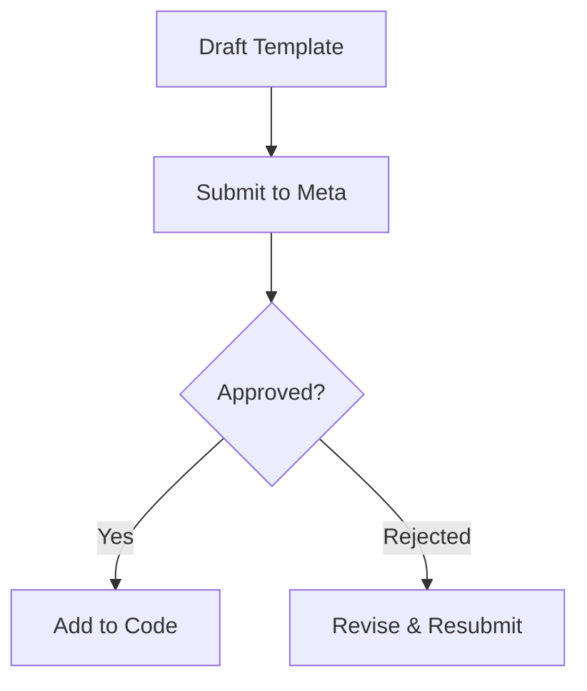

# WhatsApp Template Catalogue

> [!WARNING]
> This file is the master reference for all WhatsApp templates. Keep this document strictly in sync with `lib/omniflow.js`.

**Meta Category Note:** Most templates here belong to the **Utility** category. The `intrust_otp_verification` template is **Authentication** category (re-added, gated by `WHATSAPP_OTP_ENABLED` feature flag).

**Variable Rule:** Variables must exactly match the `{{1}}` format.

**References:** Use `/api/admin/whatsapp-health` for health checks and `/api/admin/whatsapp-test-merchant` for test sends.

## §1 — Master catalogue table

> [!NOTE]
> Templates 9 &amp; 17 are NEW. Templates 3–5 are health-tracked. Templates 19–21 are **Marketing** category.

| # | Template Name | Category | Lang | Vars | Code Symbol | Fired By |
|---|---|---|---|---|---|---|
| 1 | `intrust_welcome_linked` | Utility | en_US | 0 | `WELCOME_TEMPLATE` | Customer Linking |
| 2 | `intrust_kyc_update` | Utility | en_US | 2 | `KYC_UPDATE_TEMPLATE` | KYC Webhook |
| 3 | `intrust_transaction_alert` | Utility | en_US | 3 | `TRANSACTION_ALERT_TEMPLATE` | Ledger |
| 4 | `intrust_login_alert` | Utility | en_US | 2 | `LOGIN_ALERT_TEMPLATE` | Auth |
| 5 | `intrust_merchant_welcome_linked` | Utility | en_US | 0 | `MERCHANT_WELCOME_LINKED_TEMPLATE` | Merchant Linking |
| 6 | `intrust_merchant_new_order` | Utility | en_US | 3 | `MERCHANT_NEW_ORDER_TEMPLATE` | Order Complete |
| 7 | `intrust_merchant_order_cancelled` | Utility | en_US | 2 | `MERCHANT_ORDER_CANCELLED_TEMPLATE` | Order Cancelled |
| 8 | `intrust_merchant_payout_status_v2` | Utility | en_US | 3 | `MERCHANT_PAYOUT_STATUS_TEMPLATE` | Settlement Job |
| 9 | `intrust_merchant_payout_requested` | Utility | en_US | 2 | `MERCHANT_PAYOUT_REQUESTED_TEMPLATE` | Payout Request |
| 10 | `intrust_merchant_store_credit_request` | Utility | en_US | 3 | `MERCHANT_STORE_CREDIT_REQUEST_TEMPLATE` | Store Credit |
| 11 | `intrust_merchant_store_credit_paid` | Utility | en_US | 2 | `MERCHANT_STORE_CREDIT_PAID_TEMPLATE` | Settlement Job |
| 12 | `intrust_merchant_gift_card_sold` | Utility | en_US | 2 | `MERCHANT_GIFT_CARD_SOLD_TEMPLATE` | Gift Card Sales |
| 13 | `intrust_merchant_bank_verified` | Utility | en_US | 0 | `MERCHANT_BANK_VERIFIED_TEMPLATE` | KYC Webhook |
| 14 | `intrust_merchant_approved` | Utility | en_US | 2 | `MERCHANT_APPROVED_TEMPLATE` | Onboarding |
| 15 | `intrust_merchant_subscription_status` | Utility | en_US | 2 | `MERCHANT_SUBSCRIPTION_STATUS_TEMPLATE` | Billing |
| 16 | `intrust_merchant_product_approved` | Utility | en_US | 3 | `MERCHANT_PRODUCT_APPROVED_TEMPLATE` | Catalogue Audit |
| 17 | `intrust_merchant_procurement_sale` | Utility | en_US | 3 | `MERCHANT_PROCUREMENT_SALE_TEMPLATE` | Procurement |
| 18 | `intrust_otp_verification` | **Authentication** | en_US | 1 | `OTP_TEMPLATE` | `request-otp` (WhatsApp channel) |
| 19 | `intrust_gm_greet_v1` | **Marketing** | en_US | 1 | `GM_GREET_TEMPLATE` | Morning cron (even days) |
| 20 | `intrust_gm_tip_v1` | **Marketing** | en_US | 1 | `GM_TIP_TEMPLATE` | Morning cron (odd days) |
| 21 | `intrust_ge_greet_v1` | **Marketing** | en_US | 1 | `GE_GREET_TEMPLATE` | Evening cron |
| 22 | `intrust_reward_milestone_v1` | **Marketing** | en_US | 2 | `REWARD_MILESTONE_TEMPLATE` | Reward milestone crossing |
| 23 | `intrust_referral_invite_v1` | **Marketing** | en_US | 2 | `REFERRAL_INVITE_TEMPLATE` | Admin broadcast |
| 24 | `intrust_giftcard_promo_v1` | **Marketing** | en_US | 2 | `GIFTCARD_PROMO_TEMPLATE` | Admin broadcast |
| 25 | `intrust_winback_v1` | **Marketing** | en_US | 2 | `WINBACK_TEMPLATE` | Win-back cron (weekly) |
| 26 | `intrust_feature_announce_v1` | **Marketing** | en_US | 2 | `FEATURE_ANNOUNCE_TEMPLATE` | Admin broadcast |
| 27 | `intrust_festival_greeting_v1` | **Marketing** | en_US | 2 | `FESTIVAL_GREETING_TEMPLATE` | Admin broadcast |
| 28 | `intrust_order_status_v1` | Utility | en_US | 2 | `ORDER_STATUS_TEMPLATE` | Order Status Change |
| 29 | `intrust_wallet_low_balance_v1` | Utility | en_US | 1 | `WALLET_LOW_BALANCE_TEMPLATE` | Wallet Debit |
| 30 | `intrust_kyc_reminder_v1` | Utility | en_US | 0 | `KYC_REMINDER_TEMPLATE` | KYC Cron |
| 31 | `intrust_udhari_due_reminder_v1` | Utility | en_US | 2 | `UDHARI_DUE_REMINDER_TEMPLATE` | Udhari Cron |
| 32 | `intrust_merchant_subscription_expiring_v1` | Utility | en_US | 1 | `MERCHANT_SUBSCRIPTION_EXPIRING_TEMPLATE` | Subscription Cron |
| 33 | `intrust_merchant_payout_failed_v1` | Utility | en_US | 2 | `MERCHANT_PAYOUT_FAILED_TEMPLATE` | Payout Admin |
| 34 | `intrust_investment_maturity_v1` | Utility | en_US | 3 | `INVESTMENT_MATURITY_TEMPLATE` | Investment Cron |
| 35 | `intrust_merchant_transaction_alert_v1` | Utility | en_US | 4 | `MERCHANT_TRANSACTION_ALERT_TEMPLATE` | Money Events |

## §2 — Customer utility templates

### §2.0 — Authentication template (OTP)

> [!IMPORTANT]
> This template is **Authentication** category, not Utility. Meta controls the body/footer text for Authentication templates. The OTP is delivered via a **copy-code button**, not a body variable.

#### 18. `intrust_otp_verification`
- **Category**: Authentication
- **Language**: `en_US`
- **Body**:
  ```text
  🔐 *Secure Login — InTrust India*

  Your one-time verification code is: *{{1}}*

  This code is valid for 5 minutes. Do not share this code with anyone.
  InTrust will never ask for your OTP via call, SMS, or email.

  If you did not request this code, please ignore this message or
  contact support at intrustindia.com.
  ```
- **Variables**: {{1}} = OTP code (e.g. `"482913"`)
- **Footer**: InTrust India | Secure Authentication
- **Buttons**:
  - [Copy Code] — OTP value delivered via copy-code button
- **Component shape** (submitted to Omniflow/Meta):
  ```json
  [
    {
      "type": "button",
      "sub_type": "url",
      "index": "0",
      "parameters": [
        { "type": "text", "text": "<OTP>" }
      ]
    }
  ]
  ```
- **Feature flag**: Only used when `WHATSAPP_OTP_ENABLED=true`. Otherwise, OTP is delivered via SMS.
- **Code symbol**: `OTP_TEMPLATE` in `lib/omniflow.js`
- **Helper**: `sendWhatsAppOtp()` in `lib/notifications/otpWhatsapp.js`

### §2.1 — Customer utility templates

### 1. `intrust_welcome_linked`
- **Body**:
  ```text
  ✅ Your WhatsApp has been successfully linked to your InTrust India account.

  You can now use this chat to:
  • Check your wallet balance
  • View your KYC verification status
  • Review recent transactions

  Simply send us a message and our assistant will respond instantly.
  For detailed account management, visit: intrustindia.com
  ```
- **Footer**: InTrust India | Your Trusted Financial Partner
- **Buttons**:
  - [Quick Reply] `Check Balance`
  - [Quick Reply] `My KYC Status`

### 2. `intrust_kyc_update`
- **Body**:
  ```text
  📋 *KYC Verification Update — InTrust India*

  Your KYC status has been updated to: *{{1}}*

  {{2}}

  If you have questions about your KYC status, please visit your profile
  at intrustindia.com or reply to this message for assistance.
  ```
- **Variables**: {{1}} = KYC status, {{2}} = Action note
- **Footer**: InTrust India | Regulated & Secure
- **Buttons**: (none)

### 3. `intrust_transaction_alert`
- **Body**:
  ```text
  💸 *Transaction Alert — InTrust India*

  ₹{{1}} has been {{2}} your InTrust wallet.

  Updated Balance: *₹{{3}}*

  If you did not authorise this transaction, please contact our support
  team immediately at intrustindia.com or reply HELP.
  ```
- **Variables**: {{1}} = Transaction amount, {{2}} = Direction, {{3}} = Wallet balance
- **Footer**: InTrust India | Secure Wallet
- **Buttons**:
  - [Quick Reply] `Not Me`
  - [Quick Reply] `View Details`
  - [URL] `View Wallet`

### 4. `intrust_login_alert`
- **Body**:
  ```text
  🔐 *Security Alert — InTrust India*

  A new login was detected on your InTrust account.

  📍 Location / Device: {{1}}
  🕐 Time: {{2}}

  If this was you, no action is needed.
  If you do *not* recognise this activity, please secure your account
  immediately by visiting intrustindia.com or replying HELP.
  ```
- **Variables**: {{1}} = Location or device info, {{2}} = Timestamp
- **Footer**: InTrust India | Account Security
- **Buttons**:
  - [Quick Reply] `This Was Me`
  - [Quick Reply] `Secure My Account`
  - [URL] `Secure Account`

## §3 — Merchant utility templates

### 5. `intrust_merchant_welcome_linked`
- **Body**:
  ```text
  🤝 *Welcome to InTrust India Merchant Services*

  Your WhatsApp has been successfully linked. You will now receive real-time business alerts and transaction notifications directly here.

  *You'll stay updated on:*
  • New Order Alerts 🛍️
  • Payout & Settlement Status 💸
  • Store Credit Requests 📝
  • Security & Account Updates 🔐

  We're excited to have you onboard!
  ```
- **Footer**: InTrust India | Merchant Partner
- **Buttons**:
  - [Quick Reply] `View Dashboard`
  - [Quick Reply] `My Balance`

### 6. `intrust_merchant_new_order`
- **Body**:
  ```text
  🛍️ *New Order Received!*

  A new order has been placed at your store.

  *Order ID*: {{1}}
  *Total Amount*: ₹{{2}}
  *Items Count*: {{3}}

  Please review the order details and begin processing to ensure timely delivery.
  ```
- **Variables**: {{1}} = Order ID, {{2}} = Amount, {{3}} = Total Items
- **Footer**: InTrust India | Order Management
- **Buttons**:
  - [Quick Reply] `View Order Details`
  - [Quick Reply] `Manage Orders`

### 7. `intrust_merchant_order_cancelled`
- **Body**:
  ```text
  ❌ *Order Cancellation Alert*

  The following order has been cancelled:

  *Order ID*: {{1}}
  *Reason*: {{2}}

  No further action is required for this order. If items were already packed, please return them to inventory.
  ```
- **Variables**: {{1}} = Order ID, {{2}} = Cancellation Reason
- **Footer**: InTrust India | Inventory Update
- **Buttons**:
  - [Quick Reply] `View Order`
  - [Quick Reply] `Contact Support`

### 8. `intrust_merchant_payout_status_v2`
- **Body**:
  ```text
  💸 *Payout Processed Successfully*

  Your settlement has been initiated.

  *Amount*: ₹{{1}}
  *Status*: *{{2}}*
  *Reference*: {{3}}

  Please check your merchant dashboard for full transaction details.
  ```
- **Variables**: {{1}} = Amount, {{2}} = Payout Status, {{3}} = Ref/Note
- **Footer**: InTrust India | Secure Settlements
- **Buttons**:
  - [Quick Reply] `Settlement History`
  - [Quick Reply] `My Bank Details`

### 9. `intrust_merchant_payout_requested` **(NEW — proposed copy)**
- **Body**:
  ```text
  💸 *Payout Requested*

  A new payout request has been received.
  
  *Amount*: ₹{{1}}
  *Source*: {{2}}

  We are processing your request and will notify you upon settlement.
  ```
- **Variables**: {{1}} = Amount, {{2}} = Source
- **Footer**: InTrust India | Secure Settlements
- **Buttons**:
  - [Quick Reply] `View Payouts`

### 10. `intrust_merchant_store_credit_request`
- **Body**:
  ```text
  📝 *New Store Credit Request*

  A customer has requested to use store credit for a purchase.

  *Customer*: {{1}}
  *Amount*: ₹{{2}}
  *Item/Order*: {{3}}

  Please approve or decline this request from your merchant panel.
  ```
- **Variables**: {{1}} = Customer Name, {{2}} = Credit Amount, {{3}} = Item Description
- **Footer**: InTrust India | Credit Management
- **Buttons**:
  - [Quick Reply] `Review Request`
  - [Quick Reply] `View All Requests`

### 11. `intrust_merchant_store_credit_paid`
- **Body**:
  ```text
  ✅ *Store Credit Settlement Confirmed*

  The credit for the following item has been successfully settled to your balance.

  *Amount*: ₹{{1}}
  *Item*: {{2}}

  Thank you for supporting our store credit program.
  ```
- **Variables**: {{1}} = Amount, {{2}} = Item Name
- **Footer**: InTrust India | Ledger Update
- **Buttons**:
  - [Quick Reply] `View Ledger`
  - [Quick Reply] `Recent Credits`

### 12. `intrust_merchant_gift_card_sold`
- **Body**:
  ```text
  🎁 *Gift Card Sold!*

  A new digital gift card has been purchased from your brand.

  *Revenue*: ₹{{1}}
  *Brand*: {{2}}

  The funds have been added to your merchant wallet.
  ```
- **Variables**: {{1}} = Sale Amount, {{2}} = Brand Name
- **Footer**: InTrust India | Voucher Sales
- **Buttons**:
  - [Quick Reply] `View Sales Report`
  - [Quick Reply] `My Wallet`

### 13. `intrust_merchant_bank_verified`
- **Body**:
  ```text
  🏦 *Bank Verification Successful*

  Your bank account details have been verified by our compliance team.

  You are now eligible to receive automated payouts directly to this account.
  ```
- **Variables**: (none)
- **Footer**: InTrust India | Compliance Verified
- **Buttons**:
  - [Quick Reply] `View Bank Details`
  - [Quick Reply] `Profile Settings`

### 14. `intrust_merchant_approved`
- **Body**:
  ```text
  🎉 *Congratulations! Your Account is Approved*

  Welcome to the InTrust India Merchant family, *{{1}}*!

  Your digital storefront is now live.
  *Next Step*: {{2}}

  We look forward to helping your business grow.
  ```
- **Variables**: {{1}} = Business Name, {{2}} = Next Action
- **Footer**: InTrust India | Business Growth
- **Buttons**:
  - [Quick Reply] `Start Selling`
  - [Quick Reply] `Tutorial Guide`

### 15. `intrust_merchant_subscription_status`
- **Body**:
  ```text
  📅 *Merchant Subscription Update*

  Your current plan status has been updated.

  *Status*: *{{1}}*
  *Renewal/Expiry*: {{2}}

  Maintain an active subscription to ensure uninterrupted access to premium features.
  ```
- **Variables**: {{1}} = Plan Status, {{2}} = Date
- **Footer**: InTrust India | Subscription Services
- **Buttons**:
  - [Quick Reply] `Renew Now`
  - [Quick Reply] `Compare Plans`

### 16. `intrust_merchant_product_approved`
- **Body**:
  ```text
  📦 *Product Catalog Update*

  Our review team has finished auditing your product submission.

  *Product*: {{1}}
  *Decision*: *{{2}}*
  *Note*: {{3}}

  Thank you for maintaining our quality standards.
  ```
- **Variables**: {{1}} = Product Title, {{2}} = Approved/Rejected, {{3}} = Feedback Note
- **Footer**: InTrust India | Quality Assurance
- **Buttons**:
  - [Quick Reply] `View Product`
  - [Quick Reply] `Edit Catalog`

### 17. `intrust_merchant_procurement_sale` **(NEW — proposed copy)**
- **Body**:
  ```text
  🤝 *New Procurement Sale*

  Platform procurement order completed.
  
  *Procurement ID*: {{1}}
  *Amount*: ₹{{2}}
  *Items*: {{3}}
  ```
- **Variables**: {{1}} = Procurement ID, {{2}} = Amount, {{3}} = Item Count
- **Footer**: InTrust India | Procurement
- **Buttons**:
  - [Quick Reply] `View Details`

## §4 — Submission & verification checklist


```mermaid
graph TD
    A[Draft Template] --> B[Submit to Meta]
    B --> C{Approved?}
    C -->|Yes| D[Add to Code]
    C -->|Rejected| E[Revise & Resubmit]
```

1. Draft the template with exact body and variables.
2. Submit the template via Omniflow/Meta dashboard.
3. Wait for approval.
4. Add the template symbol and definition to `lib/omniflow.js`.
5. Verify via `/api/admin/whatsapp-health`.

## §5 — Notes for maintainers
- Keep the catalogue in sync with `lib/omniflow.js`.
- The `intrust_otp_verification` template has been re-added as an **Authentication** category template, gated by the `WHATSAPP_OTP_ENABLED` feature flag. It is used by `lib/notifications/otpWhatsapp.js`.
- Follow exactly the specified Footer and Buttons instructions.
- Refer to `docs/runbooks/omniflow-setup.md` for overall setup.

---

## §6 — Marketing templates

> [!IMPORTANT]
> These templates are **Marketing** category. Users must have `whatsapp_opt_in = true` AND `whatsapp_marketing_opt_in = true` to receive them. Submit under **Marketing** in the Omniflow/Meta dashboard, not Utility.

### 19. `intrust_gm_greet_v1`
- **Category**: Marketing
- **Language**: `en_US`
- **Body**:
  ```text
  ☀️ Good Morning, *{{1}}*!

  A new day is a new opportunity to grow your finances. 💰

  Your InTrust wallet is safe, secure, and always ready for you.
  Check your balance, review recent transactions, or explore
  what's new — all in one place.

  Have a productive and prosperous day! 🚀
  ```
- **Variables**: `{{1}}` = First name (e.g. `"Rahul"`)
- **Footer**: InTrust India | Your Trusted Financial Partner
- **Buttons**:
  - [Quick Reply] `Check My Balance`
  - [Quick Reply] `Recent Transactions`
- **Code symbol**: `GM_GREET_TEMPLATE` in `lib/omniflow.js`
- **Fired by**: `broadcastMorningGreeting()` on even days of the year
- **Cron**: `GET /api/cron/morning-greeting` at 08:00 IST daily

### 20. `intrust_gm_tip_v1`
- **Category**: Marketing
- **Language**: `en_US`
- **Body**:
  ```text
  🌅 *Good Morning from InTrust India!*

  💡 *Today's Financial Tip:*
  {{1}}

  Small, consistent steps lead to lasting financial freedom.
  Your InTrust account is the perfect place to start. 🌱
  ```
- **Variables**: `{{1}}` = Financial tip text (rotates daily, 7-tip pool in `DAILY_TIPS`)
- **Footer**: InTrust India | Smart Money Habits
- **Buttons**:
  - [Quick Reply] `Explore Features`
  - [Quick Reply] `My Wallet`
- **Code symbol**: `GM_TIP_TEMPLATE` in `lib/omniflow.js`
- **Fired by**: `broadcastMorningGreeting()` on odd days of the year
- **Cron**: `GET /api/cron/morning-greeting` at 08:00 IST daily

### 21. `intrust_ge_greet_v1` *(NEW)*
- **Category**: Marketing
- **Language**: `en_US`
- **Body**:
  ```text
  🌙 Good Evening, *{{1}}*!

  Hope your day was productive and full of good moments. 🌟

  Before you wind down, take a quick look at your InTrust wallet —
  your savings, transactions, and balance are always a tap away.

  Rest well and keep growing! 💰
  ```
- **Variables**: `{{1}}` = First name (e.g. `"Rahul"`)
- **Footer**: InTrust India | Your Trusted Financial Partner
- **Buttons**:
  - [Quick Reply] `Check My Balance`
  - [Quick Reply] `Recent Transactions`
- **Code symbol**: `GE_GREET_TEMPLATE` in `lib/omniflow.js`
- **Fired by**: `broadcastEveningGreeting()` in `lib/notifications/userWhatsapp.js`
- **Cron**: `GET /api/cron/evening-greeting` at 20:00 IST daily

> [!IMPORTANT]
> **Submission checklist for `intrust_ge_greet_v1`:**
> 1. Log in to Omniflow dashboard → Templates → New Template
> 2. Set **Category** = Marketing, **Language** = English (en_US)
> 3. Paste the body above exactly, with `{{1}}` as the only variable
> 4. Add footer: `InTrust India | Your Trusted Financial Partner`
> 5. Add two Quick Reply buttons: `Check My Balance` and `Recent Transactions`
> 6. Submit for Meta review (typically 24–48 hours)
> 7. Once approved, verify via `GET /api/admin/whatsapp-health` → `intrust_ge_greet_v1: approved: true`

## §7 — Customer promotional marketing templates

> [!IMPORTANT]
> **Marketing Templates Compliance:** All these templates must be submitted to Omniflow under the **Marketing** category. They require `whatsapp_opt_in = true` AND `whatsapp_marketing_opt_in = true` to send.

### 22. `intrust_reward_milestone_v1`
- **Category**: Marketing
- **Language**: `en_US`
- **Body**:
  ```text
  🎉 Congratulations! You've earned *{{1}}* reward points!

  Your total InTrust reward balance is now *{{2}} points*.

  Keep earning — every purchase, referral, and action brings you
  closer to bigger rewards and exclusive benefits. 💰
  ```
- **Variables**: {{1}} = Points just earned (e.g. "100"), {{2}} = Total balance (e.g. "500")
- **Footer**: InTrust India | Reward Programme
- **Buttons**:
  - [Quick Reply] `View My Rewards`
  - [Quick Reply] `Redeem Points`

### 23. `intrust_referral_invite_v1`
- **Category**: Marketing
- **Language**: `en_US`
- **Body**:
  ```text
  📣 Share InTrust India with your friends — and earn together!

  Your personal referral code is: *{{1}}*

  Every friend who joins using your code earns you *{{2}} bonus points*.
  There's no limit — the more you share, the more you earn! 🌟

  Share your code today and start growing your rewards.
  ```
- **Variables**: {{1}} = User's referral code, {{2}} = Bonus points
- **Footer**: InTrust India | Referral Programme
- **Buttons**:
  - [Quick Reply] `Share My Code`
  - [Quick Reply] `View Rewards`

### 24. `intrust_giftcard_promo_v1`
- **Category**: Marketing
- **Language**: `en_US`
- **Body**:
  ```text
  🎁 *Special Offer — InTrust Gift Cards!*

  Get *{{1}}% off* on selected gift cards — today only!

  {{2}}

  Shop gift cards in the InTrust app and treat yourself or someone special.
  ```
- **Variables**: {{1}} = Discount percentage, {{2}} = Promo details
- **Footer**: InTrust India | Gift Card Store
- **Buttons**:
  - [Quick Reply] `Browse Gift Cards`
  - [Quick Reply] `My Wallet`

### 25. `intrust_winback_v1`
- **Category**: Marketing
- **Language**: `en_US`
- **Body**:
  ```text
  👋 We miss you, *{{1}}*!

  It's been a while since you last visited InTrust India. Your
  account is safe and your *{{2}} reward points* are waiting for you.

  Come back and explore what's new — new offers, features, and
  ways to grow your money are just a tap away. 🚀
  ```
- **Variables**: {{1}} = First name, {{2}} = Current reward balance
- **Footer**: InTrust India | We Miss You
- **Buttons**:
  - [Quick Reply] `Open My Account`
  - [Quick Reply] `View Offers`

### 26. `intrust_feature_announce_v1`
- **Category**: Marketing
- **Language**: `en_US`
- **Body**:
  ```text
  ✨ *New on InTrust India: {{1}}*

  {{2}}

  Log in to explore this update and make the most of your InTrust account.
  ```
- **Variables**: {{1}} = Feature name, {{2}} = Short description
- **Footer**: InTrust India | Product Update
- **Buttons**:
  - [Quick Reply] `Learn More`
  - [Quick Reply] `Open App`

### 27. `intrust_festival_greeting_v1`
- **Category**: Marketing
- **Language**: `en_US`
- **Body**:
  ```text
  🎉 Happy *{{2}}*, *{{1}}*!

  Wishing you and your family joy, prosperity, and financial growth
  this festive season. 🌸

  From all of us at InTrust India — may your savings grow and your
  goals come true.
  ```
- **Variables**: {{1}} = First name, {{2}} = Festival name
- **Footer**: InTrust India | Festive Wishes
- **Buttons**:
  - [Quick Reply] `View My Wallet`
  - [Quick Reply] `Explore Offers`

## §8 — Additional Utility & Transaction Templates

### 28. `intrust_order_status_v1`
- **Category**: Utility
- **Language**: `en_US`
- **Body**:
  ```text
  📦 *Order Status Update*

  Your order (ID: {{1}}) is now *{{2}}*.

  Thank you for shopping with InTrust India!
  ```
- **Variables**: {{1}} = Order ID, {{2}} = Status
- **Footer**: InTrust India | Orders
- **Buttons**:
  - [Quick Reply] `View Order`

### 29. `intrust_wallet_low_balance_v1`
- **Category**: Utility
- **Language**: `en_US`
- **Body**:
  ```text
  ⚠️ *Low Wallet Balance Alert*

  Your InTrust wallet balance has dropped below ₹50.
  Current Balance: ₹{{1}}

  Top up now to ensure uninterrupted services and purchases.
  ```
- **Variables**: {{1}} = Balance
- **Footer**: InTrust India | Wallet Services
- **Buttons**:
  - [Quick Reply] `Top Up Now`
  - [Quick Reply] `View Balance`

### 30. `intrust_kyc_reminder_v1`
- **Category**: Utility
- **Language**: `en_US`
- **Body**:
  ```text
  📄 *Action Required: Complete Your KYC*

  Your InTrust account is pending KYC verification.
  Complete it today to unlock all platform features and higher limits.

  Need help? Our support team is here to assist you.
  ```
- **Variables**: (none)
- **Footer**: InTrust India | Compliance
- **Buttons**:
  - [URL] `Complete KYC`
  - [Quick Reply] `Contact Support`

### 31. `intrust_udhari_due_reminder_v1`
- **Category**: Utility
- **Language**: `en_US`
- **Body**:
  ```text
  ⏰ *Store Credit (Udhari) Payment Due*

  A payment of ₹{{1}} for your Store Credit is due on {{2}}.

  Please settle this amount to maintain your credit score and limit.
  ```
- **Variables**: {{1}} = Amount, {{2}} = Due Date
- **Footer**: InTrust India | Credit Management
- **Buttons**:
  - [Quick Reply] `Pay Now`
  - [Quick Reply] `View Details`

### 32. `intrust_merchant_subscription_expiring_v1`
- **Category**: Utility
- **Language**: `en_US`
- **Body**:
  ```text
  ⚠️ *Subscription Expiring Soon*

  Your InTrust Merchant subscription will expire on {{1}}.

  Renew your subscription to avoid any interruption to your storefront.
  ```
- **Variables**: {{1}} = Expiry Date
- **Footer**: InTrust India | Merchant Services
- **Buttons**:
  - [Quick Reply] `Renew Subscription`
  - [Quick Reply] `View Plans`

### 33. `intrust_merchant_payout_failed_v1`
- **Category**: Utility
- **Language**: `en_US`
- **Body**:
  ```text
  ❌ *Payout Request Failed*

  Your payout request of ₹{{1}} was rejected or failed.

  Reason: {{2}}

  Please review the details and try again or contact support.
  ```
- **Variables**: {{1}} = Amount, {{2}} = Reason
- **Footer**: InTrust India | Settlements
- **Buttons**:
  - [Quick Reply] `View Details`
  - [Quick Reply] `Contact Support`

### 34. `intrust_investment_maturity_v1`
- **Category**: Utility
- **Language**: `en_US`
- **Body**:
  ```text
  📈 *Investment Maturity Notice*

  Your {{1}} investment of ₹{{2}} has matured today ({{3}}).

  The returns have been credited to your wallet.
  ```
- **Variables**: {{1}} = Investment Type, {{2}} = Amount, {{3}} = Date
- **Footer**: InTrust India | Wealth
- **Buttons**:
  - [Quick Reply] `View Wallet`
  - [Quick Reply] `Reinvest`

### 35. `intrust_merchant_transaction_alert_v1`
- **Category**: Utility
- **Language**: `en_US`
- **Body**:
  ```text
  Your wallet has been updated.

  Amount: ₹{{1}}
  Type: {{2}}
  New Balance: ₹{{3}}
  Reference: {{4}}
  
  Please check your merchant dashboard for more details.
  ```
- **Variables**: {{1}} = Amount, {{2}} = Credited/Debited, {{3}} = New balance, {{4}} = Source/Reference
- **Footer**: InTrust India | Merchant Services
- **Buttons**: (none)
